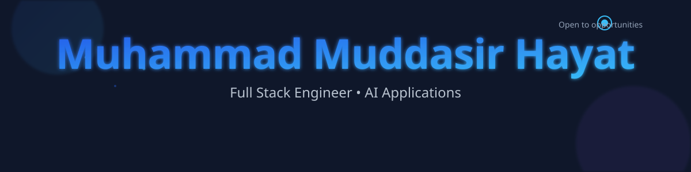
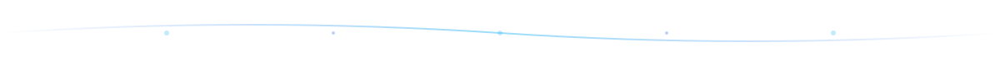

<!-- Hero Section -->

  

 
 

<!-- Divider -->

  

 

<!-- Introduction -->

  <h2 style="font-size: 32px; color: #ffffff; margin-bottom: 16px;">Full Stack Engineer Crafting AI-Powered Solutions</h2>
  

    I build modern web applications with clean architecture and excellent user experience. Passionate about AI integration, open-source development, and creating tools that solve real problems. Currently focused on building intelligent solutions that bridge the gap between technology and user needs.
  

 
 

<!-- Bento Grid Dashboard -->

<!-- Card 1: About -->

  <h3 style="color: #ffffff; font-size: 18px; margin-bottom: 12px; font-weight: 600;">About</h3>
  

    Based in Pakistan, building software that makes an impact. Focused on clean code, scalable architecture, and creating user-centered experiences.
  

<!-- Card 2: Current Focus -->

  <h3 style="color: #ffffff; font-size: 18px; margin-bottom: 12px; font-weight: 600;">Current Focus</h3>
  <ul style="color: #d1d5db; font-size: 15px; line-height: 1.8; margin: 0; padding-left: 20px;">
    <li>AI Integration & LLM Applications</li>
    <li>Full Stack Web Development</li>
    <li>Open Source Contributions</li>
  </ul>

<!-- Card 3: Currently Building -->

  <h3 style="color: #ffffff; font-size: 18px; margin-bottom: 12px; font-weight: 600;">Building Now</h3>
  

    🚀 <strong>Capverse</strong>
  

  

    AI-powered caption generation for content creators
  

<!-- Card 4: Learning -->

  <h3 style="color: #ffffff; font-size: 18px; margin-bottom: 12px; font-weight: 600;">Learning</h3>
  <ul style="color: #d1d5db; font-size: 15px; line-height: 1.8; margin: 0; padding-left: 20px;">
    <li>Advanced AI/ML Architecture</li>
    <li>System Design & Scalability</li>
    <li>Cloud Infrastructure</li>
  </ul>

<!-- Card 5: Open Source -->

  <h3 style="color: #ffffff; font-size: 18px; margin-bottom: 12px; font-weight: 600;">Open Source</h3>
  

    Active contributor to open-source projects. Believer in sharing knowledge and building community-driven solutions.
  

<!-- Card 6: Tech Stack Summary -->

  <h3 style="color: #ffffff; font-size: 18px; margin-bottom: 12px; font-weight: 600;">Tech Stack</h3>
  

    TypeScript • React • Next.js • Node.js • Express • Tailwind CSS • Prisma • PostgreSQL • Firebase • AI/ML
  

 
 

<!-- Divider -->

  

 

<!-- Featured Project: Capverse -->

  <h2 style="text-align: center; color: #ffffff; margin-bottom: 40px; font-size: 32px;">Featured Project</h2>
  
  

    
    <!-- Left: Image -->
    

      
    

    <!-- Right: Details -->
    

      <h3 style="color: #ffffff; font-size: 28px; margin-bottom: 8px; font-weight: 600;">Capverse</h3>
      

        🏆 AI Caption Generation Platform • Open Source
      

      
      

        Capverse is an intelligent caption generation platform that leverages cutting-edge AI to create engaging, SEO-optimized captions for content creators. Built with modern web technologies and designed for scale.
      

      

        
Key Features

        <ul style="color: #d1d5db; font-size: 15px; line-height: 2; margin: 0; padding-left: 20px;">
          <li>AI-powered caption generation with multiple styles</li>
          <li>Real-time processing and optimization</li>
          <li>Multi-language support</li>
          <li>Community-driven open source project</li>
        </ul>
      

      

        
Tech Stack

        

          Next.js • React • TypeScript • OpenAI API • TailwindCSS • Prisma • PostgreSQL
        

      

      <a href="https://github.com/muddasirhayat/capverse" style="display: inline-block; padding: 12px 24px; background: rgba(255, 255, 255, 0.15); color: #ffffff; border-radius: 8px; text-decoration: none; font-weight: 600; font-size: 14px; transition: all 0.3s ease; border: 1px solid rgba(255, 255, 255, 0.2); cursor: pointer;">
        View on GitHub →
      </a>
    

  

 
 

<!-- Divider -->

  

 

<!-- Other Projects -->

  <h2 style="text-align: center; color: #ffffff; margin-bottom: 40px; font-size: 32px;">Other Projects</h2>
  
  

    <!-- Project: Portfolio -->
    <a href="https://github.com/muddasirhayat" style="text-decoration: none; display: block; transition: all 0.3s ease;">
      

        
        

          <h4 style="color: #ffffff; font-size: 16px; margin: 0 0 8px 0; font-weight: 600;">Portfolio</h4>
          
Personal portfolio showcasing projects and experience

        

      

    </a>

    <!-- Project: Currency Converter -->
    <a href="https://github.com/muddasirhayat" style="text-decoration: none; display: block; transition: all 0.3s ease;">
      

        
        

          <h4 style="color: #ffffff; font-size: 16px; margin: 0 0 8px 0; font-weight: 600;">Currency Converter</h4>
          
Real-time currency exchange with live rates

        

      

    </a>

    <!-- Project: Tic Tac Toe -->
    <a href="https://github.com/muddasirhayat" style="text-decoration: none; display: block; transition: all 0.3s ease;">
      

        
        

          <h4 style="color: #ffffff; font-size: 16px; margin: 0 0 8px 0; font-weight: 600;">Tic Tac Toe AI</h4>
          
Interactive game using Minimax algorithm

        

      

    </a>

  

 
 

<!-- Divider -->

  

 

<!-- Tech Stack Detailed -->

  <h2 style="text-align: center; color: #ffffff; margin-bottom: 40px; font-size: 32px;">Technical Expertise</h2>
  
  

    <!-- Category: Frontend -->
    

      <h3 style="color: #ffffff; font-size: 16px; margin-bottom: 16px; font-weight: 600; text-transform: uppercase;">Frontend</h3>
      

        React • Next.js • TypeScript • TailwindCSS • HTML5 • CSS3 • JavaScript ES6+ • Responsive Design • Performance Optimization
      

    

    <!-- Category: Backend -->
    

      <h3 style="color: #ffffff; font-size: 16px; margin-bottom: 16px; font-weight: 600; text-transform: uppercase;">Backend</h3>
      

        Node.js • Express • REST APIs • GraphQL • Authentication • Authorization • Middleware • Error Handling
      

    

    <!-- Category: Database & ORM -->
    

      <h3 style="color: #ffffff; font-size: 16px; margin-bottom: 16px; font-weight: 600; text-transform: uppercase;">Database</h3>
      

        PostgreSQL • MongoDB • Firebase • Prisma • SQL • NoSQL • Data Modeling • Query Optimization
      

    

    <!-- Category: AI/ML -->
    

      <h3 style="color: #ffffff; font-size: 16px; margin-bottom: 16px; font-weight: 600; text-transform: uppercase;">AI/ML</h3>
      

        OpenAI API • LLM Integration • AI Prompt Engineering • ML Basics • Natural Language Processing
      

    

    <!-- Category: Cloud & DevOps -->
    

      <h3 style="color: #ffffff; font-size: 16px; margin-bottom: 16px; font-weight: 600; text-transform: uppercase;">Cloud & DevOps</h3>
      

        Vercel • Firebase • GitHub • Git • Docker • CI/CD • Environment Management • Deployment
      

    

    <!-- Category: Tools & Practices -->
    

      <h3 style="color: #ffffff; font-size: 16px; margin-bottom: 16px; font-weight: 600; text-transform: uppercase;">Tools & Practices</h3>
      

        VS Code • Linux • Figma • npm • Debugging • Testing • Code Review • Documentation • Clean Code
      

    

  

 
 

<!-- Divider -->

  

 

<!-- GitHub Analytics -->

  <h2 style="text-align: center; color: #ffffff; margin-bottom: 40px; font-size: 32px;">GitHub Activity</h2>
  
  

    <!-- GitHub Stats -->
    

      
    

    <!-- Top Languages -->
    

      
    

  

  <!-- Streak Stats -->
  

    
  

  <!-- Activity Graph -->
  

    
  

 
 

<!-- Divider -->

  

 

<!-- Connect Section -->

  <h2 style="color: #ffffff; margin-bottom: 10px;">Let's Connect</h2>
  
Have an idea? Want to collaborate? Feel free to reach out.

  
  

    
    <a href="https://github.com/muddasirhayat" style="padding: 12px 24px; background: linear-gradient(135deg, #2563EB, #38BDF8); color: white; border-radius: 8px; text-decoration: none; font-weight: 600; font-size: 14px; transition: all 0.3s ease; display: inline-block;">
      GitHub
    </a>
    
    <a href="https://www.linkedin.com/in/muddasir-hayat-170017276/" style="padding: 12px 24px; background: linear-gradient(135deg, #8B5CF6, #2563EB); color: white; border-radius: 8px; text-decoration: none; font-weight: 600; font-size: 14px; transition: all 0.3s ease; display: inline-block;">
      LinkedIn
    </a>
    
    <a href="mailto:mhsons2025@gmail.com" style="padding: 12px 24px; background: linear-gradient(135deg, #38BDF8, #8B5CF6); color: white; border-radius: 8px; text-decoration: none; font-weight: 600; font-size: 14px; transition: all 0.3s ease; display: inline-block;">
      Email
    </a>

  

 

<!-- Footer -->

  

